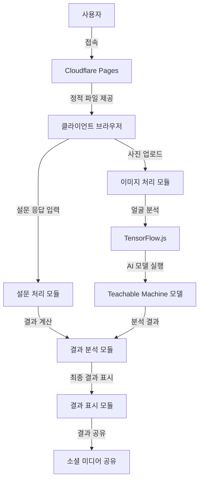
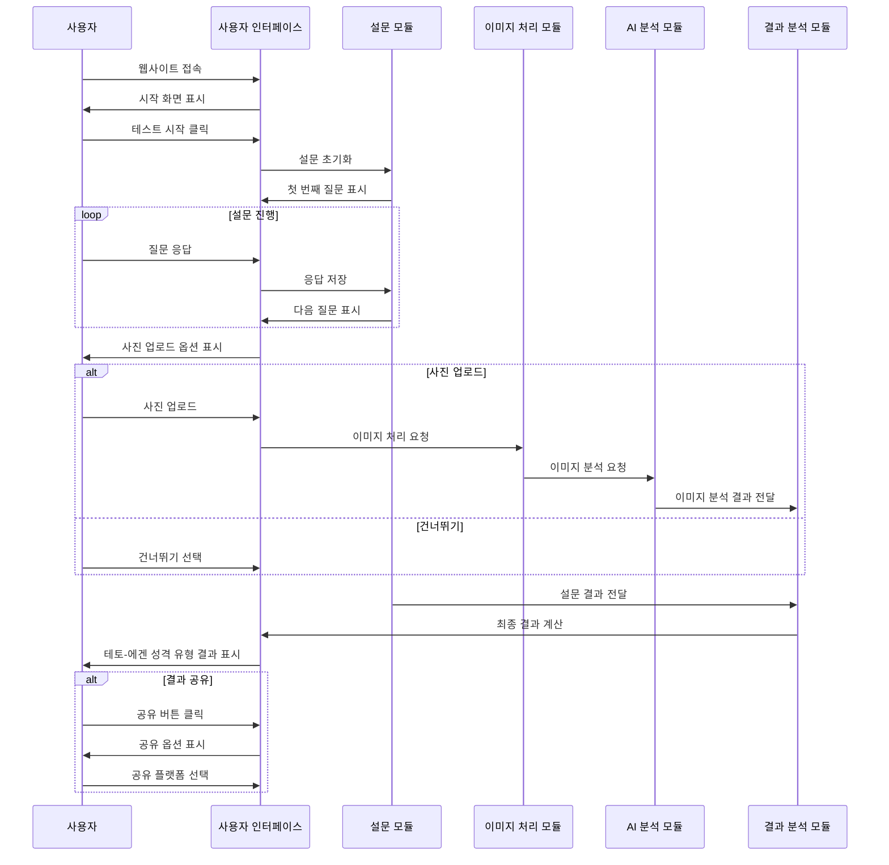

# 디자인 문서

## 개요

테토-에겐 성격 유형 테스트는 사용자가 설문조사에 응답하거나 선택적으로 얼굴 사진을 업로드하여 자신의 테토-에겐 성격 유형(테토남, 테토녀, 에겐남, 에겐녀)을 알아볼 수 있는 웹 애플리케이션입니다. 이 서비스는 Cloudflare Pages를 통해 무료로 호스팅되며, Teachable Machine과 TensorFlow.js를 활용하여 클라이언트 측에서 AI 연산을 처리함으로써 운영 비용을 최소화합니다.

## 아키텍처

테토-에겐 성격 유형 테스트는 서버리스 아키텍처를 채택하여 운영 비용을 최소화합니다. 모든 처리는 클라이언트 측에서 이루어지며, 정적 웹 호스팅 서비스인 Cloudflare Pages를 통해 배포됩니다.

### 아키텍처 다이어그램



## 컴포넌트 및 인터페이스

### 1. 사용자 인터페이스 컴포넌트

#### 1.1 시작 화면
- 테토-에겐 성격 유형 테스트 소개
- 테스트 시작 버튼
- 간단한 설명과 예시 이미지

#### 1.2 설문조사 화면
- 단계별 질문 표시
- 선택지 제공
- 진행 상태 표시 바
- 이전/다음 버튼
- 사진 업로드 옵션

#### 1.3 사진 업로드 화면
- 파일 선택 인터페이스
- 카메라 접근 옵션(모바일)
- 업로드 상태 표시
- 건너뛰기 옵션

#### 1.4 결과 화면
- 테토-에겐 성격 유형 결과 표시
- 성격 유형 특징 설명
- 연애 먹이사슬 관계도
- 소셜 미디어 공유 버튼
- 이미지 다운로드 옵션
- 다시 테스트하기 버튼

### 2. 핵심 모듈

#### 2.1 설문 처리 모듈
- 질문 데이터 관리
- 사용자 응답 수집 및 저장
- 응답 기반 점수 계산

#### 2.2 이미지 처리 모듈
- 이미지 업로드 처리
- 이미지 크기 조정 및 최적화
- 얼굴 감지 및 추출

#### 2.3 AI 분석 모듈
- TensorFlow.js 초기화 및 관리
- Teachable Machine 모델 로드
- 이미지 분석 및 결과 도출

#### 2.4 결과 분석 모듈
- 설문 결과와 이미지 분석 결과 통합
- 최종 테토-에겐 성격 유형 결정
- 결과 데이터 포맷팅

#### 2.5 공유 모듈
- 소셜 미디어 공유 기능
- 결과 이미지 생성
- 공유 링크 생성

## 데이터 모델

### 1. 사용자 응답 데이터

```typescript
interface UserResponse {
  questionId: number;
  selectedOption: number;
  weight: number;
}

interface SurveyResult {
  responses: UserResponse[];
  tetoScore: number;
  egenScore: number;
  masculinityScore: number;
  femininityScore: number;
}
```

### 2. 이미지 분석 데이터

```typescript
interface ImageAnalysisResult {
  tetoScore: number;
  egenScore: number;
  masculinityScore: number;
  femininityScore: number;
  confidence: number;
}
```

### 3. 최종 결과 데이터

enum PersonalityType {
  TETO_MALE = "테토남",
  TETO_FEMALE = "테토녀",
  EGEN_MALE = "에겐남",
  EGEN_FEMALE = "에겐녀"
}

interface PersonalityTypeInfo {
  type: PersonalityType;
  description: string;
  imageUrl: string;
}

const personalityTypeData: Record<PersonalityType, PersonalityTypeInfo> = {
  [PersonalityType.TETO_MALE]: {
    type: PersonalityType.TETO_MALE,
    description: "테토남 성격 유형에 대한 설명입니다.",
    imageUrl: "./assets/images/teto-male.jpg"
  },
  [PersonalityType.TETO_FEMALE]: {
    type: PersonalityType.TETO_FEMALE,
    description: "테토녀 성격 유형에 대한 설명입니다.",
    imageUrl: "./assets/images/teto-female.jpg"
  },
  [PersonalityType.EGEN_MALE]: {
    type: PersonalityType.EGEN_MALE,
    description: "에겐남 성격 유형에 대한 설명입니다.",
    imageUrl: "./assets/images/egen-male.jpg"
  },
  [PersonalityType.EGEN_FEMALE]: {
    type: PersonalityType.EGEN_FEMALE,
    description: "에겐녀 성격 유형에 대한 설명입니다.",
    imageUrl: "./assets/images/egen-female.jpg"
  }
}

interface TestResult {
  personalityType: PersonalityType;
  tetoScore: number;
  egenScore: number;
  masculinityScore: number;
  femininityScore: number;
  characteristics: string[];
  description: string;
  imageUrl: string;
}
```

### 4. 질문 데이터

```typescript
interface Option {
  text: string;
  tetoScore: number;
  egenScore: number;
  masculinityScore: number;
  femininityScore: number;
}

interface Question {
  id: number;
  text: string;
  options: Option[];
  weight: number;
}
```

## 사용자 흐름

### 메인 사용자 흐름



## 기술 스택

### 프론트엔드
- HTML5, CSS3, JavaScript
- jQuery - DOM 조작 및 이벤트 처리
- Bootstrap - 반응형 디자인 및 UI 컴포넌트
- TensorFlow.js - 클라이언트 측 AI 모델 실행
- Teachable Machine - AI 모델 학습 및 통합

### 배포 및 호스팅
- Cloudflare Pages - 정적 웹사이트 호스팅
- GitHub - 소스 코드 관리 및 CI/CD 연동

## 반응형 디자인

테토-에겐 성격 유형 테스트는 다양한 디바이스에서 최적의 사용자 경험을 제공하기 위해 반응형 디자인을 적용합니다.

### 데스크톱 레이아웃
- 넓은 화면을 활용한 2단 또는 3단 레이아웃
- 질문과 선택지를 한 화면에 표시
- 결과 페이지에서 상세 정보와 그래프를 함께 표시

### 태블릿 레이아웃
- 2단 레이아웃으로 조정
- 터치 인터페이스에 최적화된 버튼 크기
- 스크롤 기반 탐색

### 모바일 레이아웃
- 단일 컬럼 레이아웃
- 터치에 최적화된 큰 버튼
- 간소화된 UI 요소
- 카메라 직접 접근 기능 강화

## 오류 처리

### 1. 네트워크 오류
- 오프라인 상태 감지 및 알림
- 자동 재시도 메커니즘
- 로컬 데이터 저장을 통한 진행 상태 보존

### 2. 이미지 처리 오류
- 지원되지 않는 파일 형식 검증
- 이미지 크기 제한 및 자동 조정
- 얼굴 감지 실패 시 사용자 안내

### 3. AI 모델 로딩 오류
- 모델 로딩 실패 시 대체 경로 제공
- 설문 결과만으로 분석 진행
- 사용자에게 명확한 오류 메시지 제공

### 4. 브라우저 호환성 문제
- 지원되지 않는 브라우저 감지
- 대체 경험 제공
- 브라우저 업그레이드 안내

## 테스팅 전략

### 1. 단위 테스트
- 각 모듈의 핵심 기능 테스트
- Jest를 활용한 JavaScript 함수 테스트
- 모듈 간 의존성 최소화 및 격리 테스트

### 2. 통합 테스트
- 모듈 간 상호작용 테스트
- 데이터 흐름 검증
- 이벤트 처리 및 상태 관리 테스트

### 3. UI 테스트
- 다양한 화면 크기에서의 반응형 디자인 테스트
- 사용자 인터랙션 시나리오 테스트
- 접근성 테스트

### 4. 브라우저 호환성 테스트
- 주요 브라우저(Chrome, Firefox, Safari, Edge)에서의 동작 검증
- 모바일 브라우저 테스트
- 다양한 OS 환경 테스트

### 5. 성능 테스트
- 페이지 로딩 시간 측정
- AI 모델 실행 시간 최적화
- 메모리 사용량 모니터링

## 보안 고려사항

### 1. 사용자 데이터 보호(사진데이터는 서버로 전송되지 않음을 강조)
- 모든 처리는 클라이언트 측에서 수행되며 서버로 전송되지 않음
- 사진 데이터는 분석 후 메모리에서 즉시 제거
- 로컬 스토리지 사용 시 민감한 정보 저장 방지

### 2. 프론트엔드 보안
- 입력 데이터 검증
- XSS 방지를 위한 출력 이스케이프
- HTTPS 통신 강제

### 3. 제3자 라이브러리 보안
- 정기적인 의존성 업데이트
- 취약점 스캔 및 모니터링
- 최소한의 필요 라이브러리만 사용

## 확장성 및 유지보수

### 1. 모듈식 설계
- 기능별 모듈 분리
- 명확한 인터페이스 정의
- 의존성 주입 패턴 활용

### 2. 코드 품질 관리
- ESLint를 통한 코드 스타일 일관성 유지
- 주석 및 문서화
- 코드 리뷰 프로세스

### 3. 확장 가능성
- 새로운 성격 유형 추가 용이성
- 다국어 지원 구조(다국어는 필수지원 해야함)
- 테마 및 스타일 커스터마이징 지원