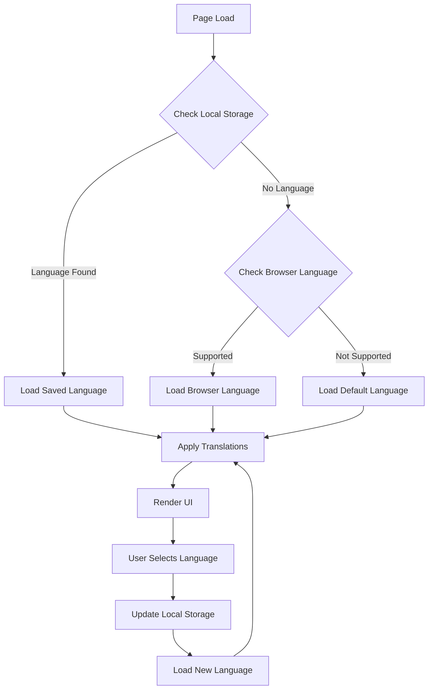

# Design Document: Language Dropdown Feature

## Overview

This design document outlines the implementation approach for adding a language dropdown menu to the Teto-Egen personality test application. The feature will allow users to select from the top 15 most spoken languages in the world, enhancing the application's accessibility and global reach. The design focuses on creating a seamless user experience while ensuring efficient performance and maintainability.

## Architecture

The language dropdown feature will be implemented using a modular approach that separates concerns between:

1. **UI Components** - The dropdown menu and related visual elements
2. **Translation Service** - Handles loading and applying translations
3. **Language Storage** - Manages user language preferences
4. **Content Translation** - The actual translated text content

This separation allows for easier maintenance and future expansion of supported languages.

### System Flow



## Components and Interfaces

### 1. Language Dropdown Component

The language dropdown will be implemented as a Bootstrap dropdown component positioned in the top-right corner of the landing page. It will include:

- Current language display with flag icon
- Dropdown menu with list of available languages
- Each language entry with flag icon and native name

#### HTML Structure

```html
<div class="language-dropdown dropdown">
  <button class="btn btn-sm dropdown-toggle" type="button" id="languageDropdown" data-bs-toggle="dropdown" aria-expanded="false">
    
    <span class="language-name">한국어</span>
  </button>
  <ul class="dropdown-menu dropdown-menu-end" aria-labelledby="languageDropdown">
    <!-- Language options will be populated here -->
  </ul>
</div>
```

### 2. Translation Service

The translation service will be responsible for:

- Loading language files
- Applying translations to the UI
- Handling language switching
- Providing fallback mechanisms

#### Interface

```javascript
// Translation service interface
const translationService = {
  // Initialize the translation service
  init: function(defaultLang) { ... },
  
  // Get current language
  getCurrentLanguage: function() { ... },
  
  // Change the current language
  changeLanguage: function(langCode) { ... },
  
  // Get a translated string
  translate: function(key, params) { ... },
  
  // Check if a language is supported
  isLanguageSupported: function(langCode) { ... },
  
  // Get all supported languages
  getSupportedLanguages: function() { ... }
};
```

### 3. Language Storage

The language preference will be stored in the browser's local storage to persist across sessions.

#### Interface

```javascript
// Language storage interface
const languageStorage = {
  // Save language preference
  saveLanguagePreference: function(langCode) { ... },
  
  // Get saved language preference
  getSavedLanguage: function() { ... },
  
  // Clear language preference
  clearLanguagePreference: function() { ... }
};
```

## Data Models

### 1. Language Model

```javascript
// Language model structure
const languageModel = {
  code: "en",           // ISO 639-1 language code
  name: "English",      // Language name in English
  nativeName: "English", // Language name in its native script
  flag: "gb",           // Country code for flag (ISO 3166-1 alpha-2)
  rtl: false,           // Whether the language is right-to-left
  dateFormat: "MM/DD/YYYY", // Date format for this language
  numberFormat: {       // Number formatting options
    decimal: ".",
    thousands: ","
  }
};
```

### 2. Translation Data Structure

Translations will be stored in JSON files with a hierarchical structure:

```json
{
  "app": {
    "title": "테토-에겐 성격 유형 테스트",
    "description": "당신의 테토-에겐 성격 유형을 알아보세요!"
  },
  "startScreen": {
    "mainTitle": "테토-에겐 성격 유형 테스트",
    "intro": "설문조사와 얼굴 사진을 통해 당신이 테토남, 테토녀, 에겐남, 에겐녀 중 어떤 유형인지 알아보세요!",
    "startButton": "테스트 시작하기"
  },
  "personalityTypes": {
    "tetoMale": "테토남",
    "tetoFemale": "테토녀",
    "egenMale": "에겐남",
    "egenFemale": "에겐녀"
  }
}
```

### 3. Supported Languages

The application will support the top 15 most spoken languages in the world:

1. English (en)
2. Mandarin Chinese (zh)
3. Hindi (hi)
4. Spanish (es)
5. French (fr)
6. Arabic (ar)
7. Bengali (bn)
8. Russian (ru)
9. Portuguese (pt)
10. Indonesian (id)
11. Urdu (ur)
12. German (de)
13. Japanese (ja)
14. Swahili (sw)
15. Korean (ko) - Default

## Error Handling

### Translation Fallbacks

1. If a translation key is missing in the selected language, the system will fall back to the default language (Korean).
2. If the key is also missing in the default language, the system will display the key itself with a special formatting to indicate the missing translation.

### Language Loading Errors

1. If loading a language file fails, the system will display an error message and fall back to the default language.
2. The system will retry loading the language file up to 3 times before giving up.

### Unsupported Languages

1. If a user's browser language is not supported, the system will default to Korean.
2. The system will provide visual feedback when a language is not available.

## Testing Strategy

### Unit Tests

1. Test the translation service functions
2. Test language detection and fallback mechanisms
3. Test local storage operations
4. Test translation key resolution and parameter substitution

### Integration Tests

1. Test language switching and UI updates
2. Test persistence of language preferences
3. Test loading of language files
4. Test integration with the existing application

### User Acceptance Testing

1. Verify correct display of all languages, especially RTL languages
2. Verify correct translation of all UI elements
3. Verify performance when switching languages
4. Verify correct behavior on different devices and browsers

## Implementation Considerations

### Performance Optimization

1. **Lazy Loading**: Only load the selected language file on demand
2. **Caching**: Cache loaded language files in memory
3. **Minification**: Minify language files for production
4. **Compression**: Use gzip/brotli compression for language files

### Accessibility

1. Ensure the language dropdown is keyboard accessible
2. Add appropriate ARIA attributes for screen readers
3. Ensure sufficient color contrast for the dropdown
4. Provide text alternatives for flag icons

### Internationalization (i18n) Best Practices

1. Use ISO language codes for consistency
2. Handle pluralization rules for different languages
3. Support date and number formatting based on locale
4. Handle text expansion/contraction in different languages

### Mobile Responsiveness

1. Ensure the dropdown is usable on small screens
2. Adjust dropdown positioning on mobile devices
3. Ensure touch targets are large enough
4. Consider alternative UI for very small screens (e.g., language selection in a menu)